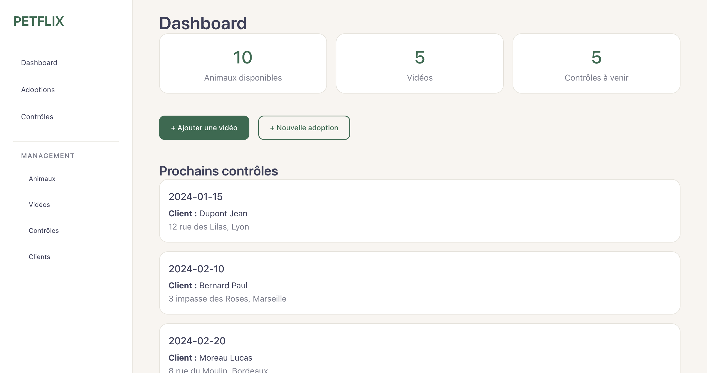
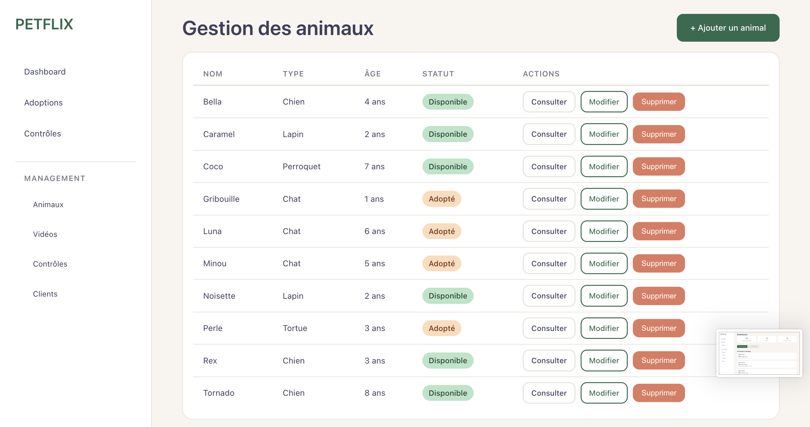

# Petflix – Gestion d'adoptions et vidéos pour animaux
 
Petflix est une application web permettant de gérer un refuge pour animaux, leurs adoptions, ainsi que des vidéos associées pour le suivi et la communication. L'interface est pensée comme un dashboard simple et ergonomique, facilitant la gestion au quotidien.
 
---

## Screenshots

 
## Fonctionnalités
 
### Gestion des animaux
- Liste des animaux disponibles à l'adoption.
- Création, modification et suivi des informations des animaux.
- Filtrage par type d'animal ou ville.
 
### Gestion des adoptions
- Attribution d'un ou plusieurs animaux à un client.
- Suivi des membres responsables pour chaque adoption.
- Formulaire simplifié pour les nouvelles adoptions.
 
### Gestion des vidéos
- Ajout et visualisation de vidéos liées aux animaux.
- Association des vidéos à un ou plusieurs animaux.
- Interface responsive pour visionner les vidéos depuis le dashboard.
 
### Contrôles et suivis
- Gestion des contrôles à venir (ex : visites de suivi post-adoption).
- Association des animaux, clients et membres responsables.
- Vue globale des prochains contrôles.
 
---
 
## 🛠️ Technologies utilisées
 
| Technologie | Rôle |
|---|---|
| PHP 8 | Backend |
| MySQL | Base de données |
| HTML / CSS / JS | Frontend |
| Git | Gestion de version |
 
> Architecture **MVC** simple pour séparer la logique, les vues et les données.

---

## Screenshots

